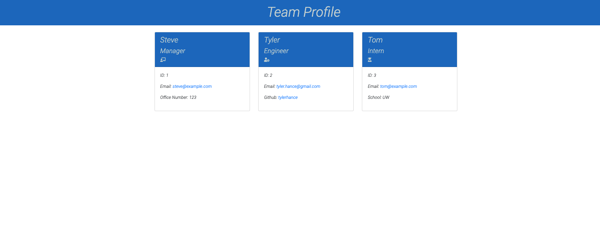

# team-profile-generator  

<h2>Description</h2>

*   The task was to build a Node.js command-line applications that takes in information about employees on a development team, then generates an HTML webpage that displays summaries for each person. 

* I began by writing tests using jest to ensure the code would be easily maintainable and scalable. This project utilizes the Inquirer module from Node.js and implementation of OOP and TDD using Jest.

## Table of Contents
* [User Story](#userstory)
* [Installation](#installation)
* [Usage](#usage)
* [Questions](#questions)

<h2>User Story</h2>

*   AS A manager
    I WANT to generate a webpage that displays my team's basic info
    SO THAT I have quick access to their emails and GitHub profiles

<h2>Installation</h2>

* The user can clone the repo from GitHub and download Node. It will also require fs and the Inquire module. For testing, make sure to install Jest.

<h2>Usage</h2>

* Use Inquirer from the command line to follow the prompts to complete the form. A walk-through video can be viewed [Here](https://drive.google.com/file/d/15EzGw7XT8Q5v4nO5FjTXcMAe3_USHiMX/view) 

<h2>Questions</h2>

* If you have any questions, please feel free to contact me @ tyler.hance@gmail.com or visit my repo for additional projects @ https://github.com/tylerhance.
